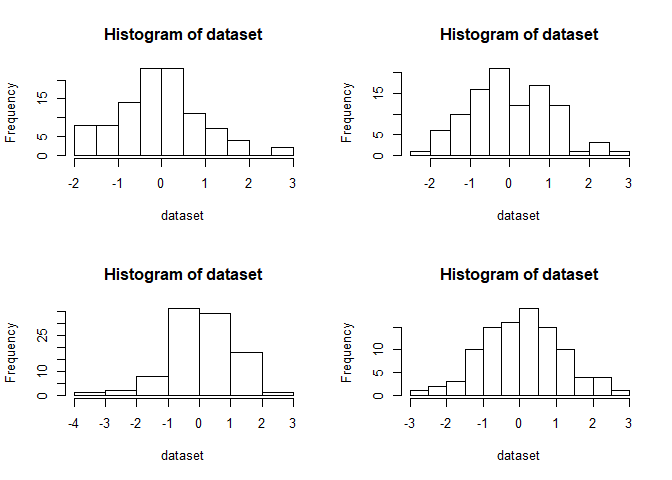
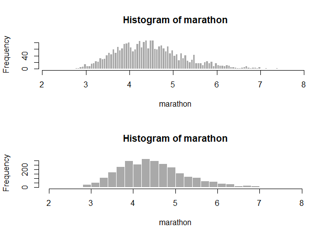

Problem Set 1
================
Ethan Witkowski
Spring 2019

<br>

#### 3a)

Define Variables:

``` r
xbar <- 121.07
mu <- 120
SD <- 16.59
n = 371
alpha = .05
SDx = (SD/sqrt(n))
df = n-1
```

 <br> 

``` r
tstat <- (xbar-mu)/SDx
tstat
```

    ## [1] 1.242294

``` r
pvalue <- 2*pt(-abs(tstat),df)
pvalue
```

    ## [1] 0.2149149

Because \>.05, we fail
to reject the null, and these control subjects do not differ
significantly from a normal population. <br> <br>

#### 3b)

``` r
n2 <- 3710
SDx2 <- (SD/sqrt(n2))
df2 <- 3709

tstat_b <- (xbar-mu)/SDx2
tstat_b
```

    ## [1] 3.928478

``` r
pvalue_b <- 2*pt(-abs(tstat_b),df2)
pvalue_b
```

    ## [1] 8.704141e-05

Effect size is the magnitude of difference between means; statistical
significance is our confidence that the effect size is not occurring due
to chance.

An increase in n, holding the effect size constant, increases the
statistical significance. <br> <br>

#### 3c)

``` r
CIlower <- (mu-(1.96*SDx2))
CIlower
```

    ## [1] 119.4662

``` r
CIhigher <- (mu+(1.96*SDx2))
CIhigher
```

    ## [1] 120.5338

This confidence interval does contain 120. <br> <br>

#### 4a)

Generate random samples, create 4 histograms.

``` r
par(mfrow=c(2,2))
for (i in 1:4) {
  dataset <- rnorm(10,0,1)
  hist(dataset)
}
```

<!-- --> <br>
The samples do not appear to be normal. <br> <br>

#### 4b)

Generate random sample, create 4 QQplots.

``` r
par(mfrow=c(2,2))
for (i in 1:4) {
  dataset <- rnorm(10,0,1)
  qqnorm(dataset)
  abline(0,1,col=gray(.7))
}
```

<!-- --> <br>
The samples do not appear to be normal. <br> <br>

#### 4c)

Repeat sampling with 100 observations.

``` r
par(mfrow=c(2,2))
for (i in 1:4) {
  dataset <- rnorm(100,0,1)
  hist(dataset)
}
```

<!-- --> <br>

``` r
par(mfrow=c(2,2))
for (i in 1:4) {
  dataset <- rnorm(100,0,1)
  qqnorm(dataset)
  abline(0,1,col=gray(.7))
}
```

<!-- --> <br>
The samples appear to more closely resemble a normal distribution. <br>
<br>

#### 5a)

``` r
datasetbmi <- read.csv("C:\\Users\\ethan\\Desktop\\Swarthmore\\Spring 2019\\Statistics II\\Problem Sets\\Problem Set 1\\bmi.csv", header=T)

bmi <- datasetbmi[,"bmi"]
status <- datasetbmi[,"status"]
```

<br> <br>

#### 5b)

``` r
meandiff <- mean(bmi[status==1]) - mean(bmi[status==99])
meandiff
```

    ## [1] 3.431874

<br> <br>

#### 5c)

``` r
numshuffles <- 1000
diffs <- rep(NA, numshuffles)

for(i in 1:numshuffles) {
  newstatus <- sample(status)
  diffs[i] <- mean(bmi[newstatus==1]) - mean(bmi[newstatus==99])
}
```

<br> <br>

#### 5d)

``` r
par(mfrow=c(1,1))
hist(diffs)
abline(v=meandiff, col="red")
```

<!-- -->

``` r
pvalue_diff <- meandiff/numshuffles
pvalue_diff
```

    ## [1] 0.003431874

The null hypothesis is rejected because
\<.05. <br> <br>

#### 6a)

``` r
marathon <- scan("C:\\Users\\ethan\\Desktop\\Swarthmore\\Spring 2019\\Statistics II\\Problem Sets\\Problem Set 1\\nycmarathon.csv")

par(mfrow=c(2,1))

hist(marathon, col="darkgrey", border="white", nclass=200)
hist(marathon, col="darkgrey", border="white", nclass=30)
```

<!-- -->
