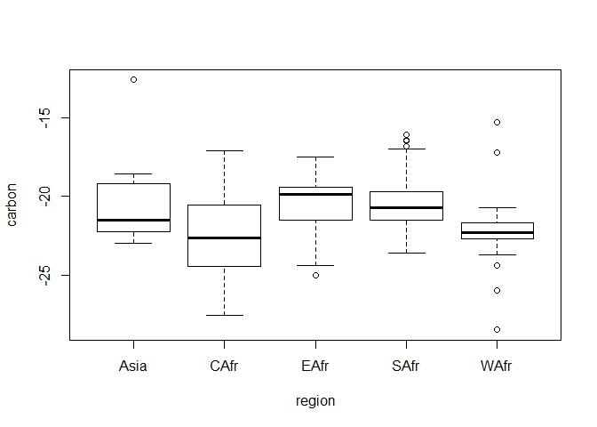
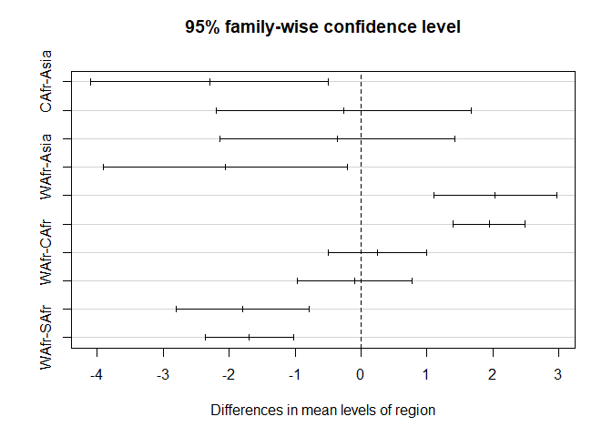
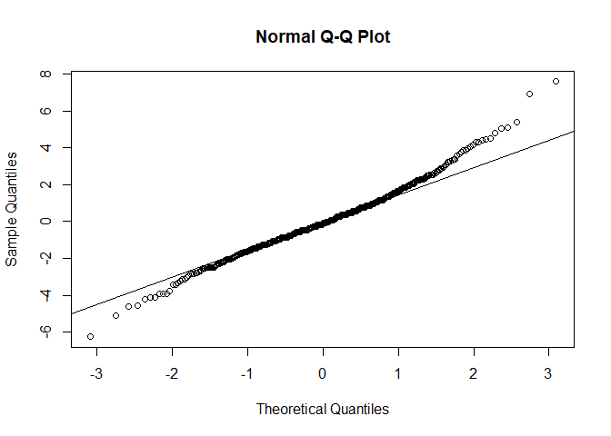

Problem Set 2
================
Ethan Witkowski
Spring 2019

<br> <br>

#### 1a)

At the lowest and highest percentiles, Psychology and Classics students
score the same. However, within the bounds of the distributions,
Classics students score higher than Psychology students.

At the lowest and highest percentiles, Psychology and Economics students
score the same. However, Economics students score higher than Psychology
students at higher percentiles, while Psychology students score higher
than Economics students at lower percentiles. <br> <br>

#### 1b)

A Q-Q plot of the distributions of SAT verbal and quantitative test
scores displays how the scores for each test compare at different
percentiles.

A scatterplot plotting the verbal and quantitative SAT test scores
displays what a student’s verbal test score is, given a quantitative
score (or vice versa). Across the range of scores, this discerns the
relationship (correlation) between verbal and quantitative SAT test
scores.

A Q-Q plot and scatterplot differ in that one evaluates distributions of
two datasets and the other evaluates how verbal test scores vary given a
range of quantitative scores (or vice versa). <br> <br>

#### 2a)

``` r
anova_table <- data.frame("Source" = c("Between","Within","Total"),
                          "Df" = c(1,98,99),
                          "Sum Sq" = c(1869.2,10593.8,12463),
                          "Mean Sq" = c(1869.2,108.1," "),
                          "F-value" = c(17.29," "," "))

anova_table
```

    ##    Source Df  Sum.Sq Mean.Sq F.value
    ## 1 Between  1  1869.2  1869.2   17.29
    ## 2  Within 98 10593.8   108.1        
    ## 3   Total 99 12463.0

<br> <br>

#### 2b)

 <br> <br>

#### 3a)

``` r
ivorydataset <- read.csv("C:/Users/ethan/Desktop/Swarthmore/Spring 2019/Statistics II/Problem Sets/Problem Set 2/ivory.csv", header = T)
```

<br> <br>

#### 3b)

``` r
region <- ivorydataset[,"Region"]
carbon <- ivorydataset[,"delta13C"]

boxplot(carbon ~ region)
```

<!-- -->

Carbon ratios of ivory from different regions do vary, however, they do
not vary a great amount. It is unclear if they vary significantly.

The assumption of normality appears to hold, however, they are not
perfectly normal distributions.

It is not clear that the assumption of equal variances holds true for
this dataset. <br> <br>

#### 3c)

``` r
fit1 <-lm(carbon ~ region)
anova(fit1)
```

    ## Analysis of Variance Table
    ## 
    ## Response: carbon
    ##            Df  Sum Sq Mean Sq F value    Pr(>F)    
    ## region      4  413.65 103.412  31.651 < 2.2e-16 ***
    ## Residuals 490 1600.93   3.267                      
    ## ---
    ## Signif. codes:  0 '***' 0.001 '**' 0.01 '*' 0.05 '.' 0.1 ' ' 1

There is a significant difference in carbon ratios from ivory in
different regions.

This is because the p-value is less than .10 (\< 2.2e-16). <br> <br>

#### 3d)

``` r
posthoc <- TukeyHSD(aov(fit1))
posthoc
```

    ##   Tukey multiple comparisons of means
    ##     95% family-wise confidence level
    ## 
    ## Fit: aov(formula = fit1)
    ## 
    ## $region
    ##                  diff        lwr        upr     p adj
    ## CAfr-Asia -2.29916667 -4.1062811 -0.4920522 0.0048776
    ## EAfr-Asia -0.26385135 -2.1934931  1.6657904 0.9958149
    ## SAfr-Asia -0.35771073 -2.1340552  1.4186337 0.9817489
    ## WAfr-Asia -2.05452899 -3.9029126 -0.2061454 0.0207243
    ## EAfr-CAfr  2.03531532  1.1046905  2.9659401 0.0000000
    ## SAfr-CAfr  1.94145594  1.3956127  2.4872991 0.0000000
    ## WAfr-CAfr  0.24463768 -0.5030703  0.9923457 0.8984088
    ## SAfr-EAfr -0.09385938 -0.9632267  0.7755079 0.9983329
    ## WAfr-EAfr -1.79067763 -2.7991031 -0.7822521 0.0000155
    ## WAfr-SAfr -1.69681826 -2.3667468 -1.0268898 0.0000000

``` r
plot(posthoc)
```

<!-- -->

The regions that are significantly different are: Central Africa & Asia,
West Africa & Asia, East Africa & Central Africa, South Africa & Central
Africa, West Africa & East Africa, West Africa & South Africa <br> <br>

#### 3e)

``` r
ivoryresiduals <- residuals(fit1)
qqnorm(ivoryresiduals)
qqline(ivoryresiduals)
```

<!-- -->

The residuals appear to form a T-distribution, not a normal
distribution. <br> <br>

#### 3f)


``` r
Rsquared <- 413.65/(1600.93 + 413.65)
Rsquared
```

    ## [1] 0.2053282

0.205 is a relatively low R-squared value. <br> <br>

#### 3g)

An ivory sample’s carbon ratio should not be used to determine its
region of origin as the low r-squared value indicates a small effect
size.

It is similar because we are very confident there is a difference
(statistical significance), due to the small p-value, but the difference
in the maginitude between means is quite small (effect size).

In turn, statistical significance does not necessarily lead to a large
effect size. <br> <br>

#### 3h)

We should test if nitrogen and oxygen ratios are predictors of region of
origin.

We may log transform the data to closer satisfy the normality and equal
variance assumptions. <br> <br>

#### 5a)

Researcher degrees of freedom is the set of methods a researcher can use
in their experiment or analysis of data. It includes the type of
observation, sample size, accounting for confounding variables,
statistical technique, etc. P-hacking occurs when a researcher explores
multiple degrees of freedom, but only publishes the method that produces
the result they desire. <br> <br>

#### 5b)

You should not believe a result from any one scientific study because,
as the article shows, researchers can obtain conflicting results by
using different methods or datasets. This is especially true for results
with a p-value close to .05, as nearly 5% of the time the result may be
due to chance. We should consider a finding reliable when multiple
replication studies show the same result. <br> <br>

#### 5c)

Replication studies are studies that repeat the methods of an already
published study to assure the results are valid. Replication studies are
rare because there is little incentive for scientists to perform them,
as they will gain more recognition if they perform exploratory research
to find novel results.
