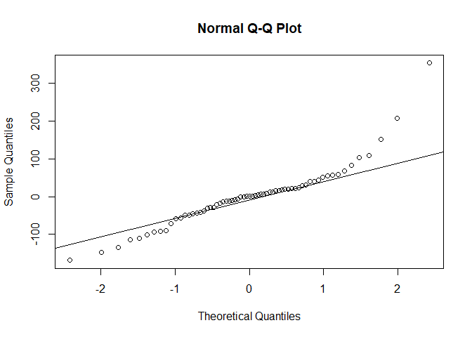

Problem Set 3
================
Ethan Witkowski
Spring 2019

<br> <br>

#### 1\)

<!-- -->

The distribution of Y at X=4 does not represent a normal distribution.
Because normality is assumed for all conditional distributions of x
values, the skewed distribution at x=4 violates this assumption. Due to
this violation, the least-squares line does not pass through the
conditional mean at this x value. <br> <br>

#### 2\)

No, this is not the correct interpretation; this interpretation assumes
causality between weight and height, which cannot be inferred with
regression analysis. It means that if an individual is 10 pounds heavier
than another individual, the model predicts they will also be .47 inches
taller. <br> <br>

#### 3\)

``` r
meanheight <- 62.4 + (.047) * (200)
meanheight
```

    ## [1] 71.8

``` r
SD <- 2.2

targetheight <- 74

heightdiff <- targetheight - meanheight
heightdiff
```

    ## [1] 2.2

``` r
SDsaway <- heightdiff/SD
SDsaway
```

    ## [1] 1

``` r
PercentageAbove <- 1 - pnorm(SDsaway)
PercentageAbove
```

    ## [1] 0.1586553

The percentage of all 200-pound men above 74 inches is 0.159%. <br> <br>

#### 4\)

C must be true. This is because the marginal SD for both Y1 and Y2 are
the same, while the conditional SD for Y2 is smaller than the
conditional SD for Y1. This means that there is a larger decrease in
error due to the introduction of X2 when predicting Y2 than the decrease
in error due to the introduction of X1 when predicting Y1. This results
in the correlation between X2 and Y2 being larger than the correlation
between X1 and Y1. <br> <br>

#### 5\)

This is not the correct regression line. This is because at the lower
bound of the x axis there are more points above than the line than
below, and at the higher bound of the x axis there are more points below
the line than above. The true regression line would have a flatter slope
and start higher on the y axis. <br> <br>

#### 6a)

``` r
data <- read.csv("C:/Users/ethan/Desktop/Swarthmore/Spring 2019/Statistics II/Problem Sets/Problem Set 3/skyscrapers.csv")

height <- data[,"height"]
stories <- data[,"stories"]
year <- data[,"year"]
building <- data[,"building"]

plot(stories, height)
```

<!-- -->

There appears to be a strong, linear relationship. <br> <br>

#### 6b)

``` r
correlation <- cor(stories, height)
correlation
```

    ## [1] 0.9556949

There is a strong correlation between the variables. <br> <br>

#### 6c)

``` r
fit1 <- lm(height ~ stories)
summary(fit1)
```

    ## 
    ## Call:
    ## lm(formula = height ~ stories)
    ## 
    ## Residuals:
    ##     Min      1Q  Median      3Q     Max 
    ## -168.66  -41.48    0.81   24.10  353.23 
    ## 
    ## Coefficients:
    ##             Estimate Std. Error t value Pr(>|t|)    
    ## (Intercept)  65.1574    23.0423   2.828  0.00628 ** 
    ## stories      12.0979     0.4695  25.770  < 2e-16 ***
    ## ---
    ## Signif. codes:  0 '***' 0.001 '**' 0.01 '*' 0.05 '.' 0.1 ' ' 1
    ## 
    ## Residual standard error: 80.05 on 63 degrees of freedom
    ## Multiple R-squared:  0.9134, Adjusted R-squared:  0.912 
    ## F-statistic: 664.1 on 1 and 63 DF,  p-value: < 2.2e-16

Regression Model:

Building Height = 65.16 + (12.09)Number of Stories <br>

Conditional Standard Deviation:

``` r
ConditionalSD <- 80.05/(63-2)
ConditionalSD
```

    ## [1] 1.312295

<br> R-squared = .9134 <br> <br>

#### 6d)

``` r
t <- qt(.025, 61)
t
```

    ## [1] -1.999624

``` r
ConfidenceIntervalbound <- 12.0979 - ((t)*(.4695))
ConfidenceIntervalboundtwo <- 12.0979 + ((t)*(.4695))

ConfidenceIntervalbound
```

    ## [1] 13.03672

``` r
ConfidenceIntervalboundtwo
```

    ## [1] 11.15908

<br> <br>

#### 6e)


``` r
tstat <- 12.0979/.4695
tstat
```

    ## [1] 25.76763

``` r
pvalue <- 2*pt(-tstat,61)
pvalue
```

    ## [1] 1.732765e-34

The conclusion is expected, as the confidence interval for

does not include zero. <br> <br>

#### 6f)

``` r
plot(fitted(fit1), resid(fit1))
abline(h=0)
```

<!-- -->

There are no clear violations, however, there is some concern with the
downward trend from 400-600. <br> <br>

#### 6g)

``` r
qqnorm(resid(fit1))
qqline(resid(fit1))
```

<!-- -->

Yes, there is a violation of the assumption that the conditional
distribution for Y is normal for any given X. The QQplot represents a
t-distribution. <br> <br>

#### 6h)

``` r
plot(year, resid(fit1))
```

<!-- -->

``` r
plot(year, stories)
```

<!-- -->

There appears to be a gap between 1936 and 1960 where no buildings are
built (in this dataset). This makes sense as much of the world was
involved in World War 2 from 1939-1945, where all the raw materials such
as steel and concrete were used to make armaments and military outposts.

The amount of buildings also increases post 1965. This makes sense as
the rise of multinational, large corporations occurred around 1965, and
these corporations had the capital to invest in building.

Their appears to be an increase in the variance of height/story ratio
across time. This may be due to a diversification of building
architecture styles across time. <br> <br>

#### 6i)

``` r
plot(year, resid(fit1))
abline(h=0)
identify(year, resid(fit1), labels=building, cex=.6)
```

<!-- -->

    ## integer(0)

Yes, the Transamerica Pyramid, 2 Liberty Place, and the Petronas Towers
have unusally high heights for their number of stories.

It was ruled that antennas on top of skyscrapers do not add to the
height of the building.

All three of these building have a tapered top, which allow for extra
height, without the addition of extra stories.
