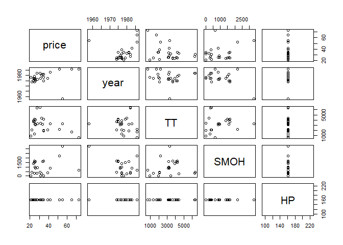
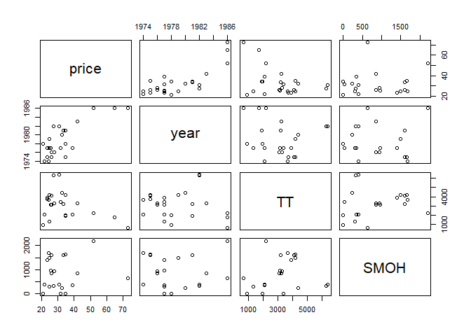
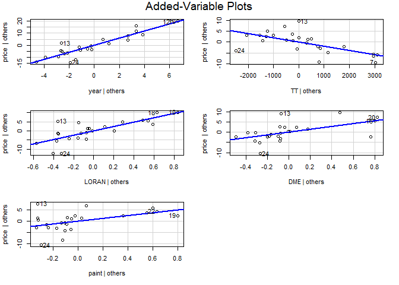
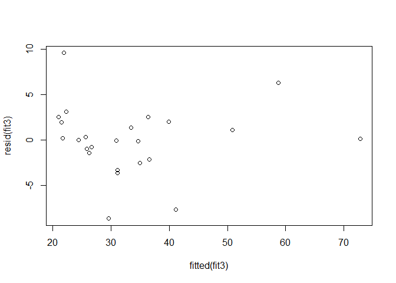
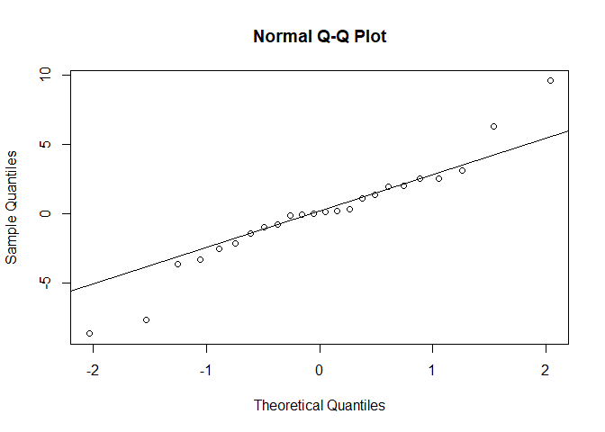

Problem Set 4
================
Ethan Witkowski
Spring 2019

<br> <br>

#### 3a)

True. Due to super additivity, X3 and another X variable may be poor
predictors by themselves, but could become significant, stronger
predictors when both are input into a multiple regression. <br> <br>

#### 3b)

True. The other X variable in the multiple regression could be collinear
with X3, which could make X3 non-significant predictor. <br> <br>

#### 3c)

False. Leverage is only a measure of the X variable distance to its
mean. Taking the log of the Y variable would not affect the leverage
distance. <br> <br>

#### 3d)

True. Cook’s distance is a combination of the residual and leverage
distances of the point. Cook’s distance would be affected by taking the
log of Y, because residuals measure the distance to the conditional mean
for the point in the Y direction. <br> <br>

#### 4a)

``` r
# read in dataset
airplanes <- read.csv("C:/Users/ethan/Desktop/Swarthmore/Spring 2019/Statistics II/Problem Sets/Problem Set 4/airplanes.csv")

#Drop missing values
airplanes <- airplanes[-26,]

# define variables
price <- airplanes[,"price"]
year <- airplanes[,"year"]
TT <- airplanes[,"TT"]
SMOH <- airplanes[,"SMOH"]
LORAN <- airplanes[,"LORAN"]
DME <- airplanes[,"DME"]
HP <- airplanes[,"HP"]
paint<- airplanes[,"paint"]
```

<br> <br>

#### 4b)

Scatterplot matrix:

``` r
#Column bind quantitative variables
quantairplanes <- cbind(price,year,TT,SMOH,HP)

#scatterplot quantitative variable matrix
pairs(quantairplanes)
```

<!-- -->

None of the scatterplots show a linear relationship (excluding HP).

HP has the same value for all data observations <br> <br>

#### 4c)

The variable HP is the same integer (161) for every data point, which
results in a straight line with 0 or no slope. Therefore, we omit HP.
<br> <br>

#### 4d)

The plane built in 1958 appears to be the outlier. It is an incorrect
data entry; this is because there were no Piper Warrior planes
manufactured before 1970. <br> <br>

#### 4e)

``` r
#Drop row 13 
airplanes <- airplanes[-13,]

# Redefine variables
price <- airplanes[,"price"]
year <- airplanes[,"year"]
TT <- airplanes[,"TT"]
SMOH <- airplanes[,"SMOH"]
LORAN <- airplanes[,"LORAN"]
DME <- airplanes[,"DME"]
HP <- airplanes[,"HP"]
paint<- airplanes[,"paint"]

newquantairplanes <- cbind(price,year,TT,SMOH)
pairs(newquantairplanes)
```

<!-- --> <br>
<br>

#### 4f)

SMOH is hours since major overhaul.

There may be missing SMOH values because the sellers may have not
overhauled the plane recently, and they didn’t want to advertise this
fact.

``` r
#Impute missing values
SMOH2 <- SMOH
SMOH2[2]=1731
SMOH2[9]=1900
SMOH2[17]=3700

#Re-run model
fit2 <- lm(price ~ year + TT + SMOH2 + LORAN + DME + paint)
summary(fit2)
```

    ## 
    ## Call:
    ## lm(formula = price ~ year + TT + SMOH2 + LORAN + DME + paint)
    ## 
    ## Residuals:
    ##     Min      1Q  Median      3Q     Max 
    ## -8.3108 -1.7276  0.3489  1.4210  9.9711 
    ## 
    ## Coefficients:
    ##               Estimate Std. Error t value Pr(>|t|)    
    ## (Intercept) -5.799e+03  5.883e+02  -9.857 1.91e-08 ***
    ## year         2.947e+00  2.972e-01   9.919 1.74e-08 ***
    ## TT          -1.938e-03  6.598e-04  -2.937 0.009215 ** 
    ## SMOH2        4.592e-04  1.070e-03   0.429 0.673338    
    ## LORAN        1.185e+01  2.420e+00   4.896 0.000136 ***
    ## DME          6.953e+00  2.538e+00   2.739 0.013981 *  
    ## paint        5.920e+00  2.789e+00   2.122 0.048791 *  
    ## ---
    ## Signif. codes:  0 '***' 0.001 '**' 0.01 '*' 0.05 '.' 0.1 ' ' 1
    ## 
    ## Residual standard error: 4.421 on 17 degrees of freedom
    ## Multiple R-squared:  0.9162, Adjusted R-squared:  0.8866 
    ## F-statistic: 30.97 on 6 and 17 DF,  p-value: 3.013e-08

The R-squared value increased to .9162.

The Conditional SD is the same.

Both paint and DME become significant. <br> <br>

#### 4g)

``` r
fit3 <- lm(price ~ year + TT + LORAN + DME + paint)
summary(fit3)
```

    ## 
    ## Call:
    ## lm(formula = price ~ year + TT + LORAN + DME + paint)
    ## 
    ## Residuals:
    ##     Min      1Q  Median      3Q     Max 
    ## -8.6482 -1.5775  0.0729  1.9529  9.5815 
    ## 
    ## Coefficients:
    ##               Estimate Std. Error t value Pr(>|t|)    
    ## (Intercept) -5.815e+03  5.738e+02 -10.134 7.27e-09 ***
    ## year         2.955e+00  2.898e-01  10.199 6.58e-09 ***
    ## TT          -1.910e-03  6.415e-04  -2.977  0.00808 ** 
    ## LORAN        1.196e+01  2.351e+00   5.089 7.66e-05 ***
    ## DME          7.020e+00  2.475e+00   2.836  0.01096 *  
    ## paint        6.125e+00  2.685e+00   2.282  0.03491 *  
    ## ---
    ## Signif. codes:  0 '***' 0.001 '**' 0.01 '*' 0.05 '.' 0.1 ' ' 1
    ## 
    ## Residual standard error: 4.32 on 18 degrees of freedom
    ## Multiple R-squared:  0.9153, Adjusted R-squared:  0.8917 
    ## F-statistic: 38.89 on 5 and 18 DF,  p-value: 4.932e-09

<br> <br>

#### 4h)

Year and TT are not collinear, as the scatterplot of year and TT does
not show a linear relationship. <br> <br>

#### 4i)

Yes, I can create a 2x2 table with 0 or 1 on each side of a box. If
diagonal boxes both have relatively high values, and the opposite
diagonal boxes are relatively low values, the variables are correlated.

``` r
table(DME,LORAN)
```

    ##    LORAN
    ## DME  0  1
    ##   0 15  4
    ##   1  3  2

``` r
table(DME,paint)
```

    ##    paint
    ## DME  0  1
    ##   0 15  4
    ##   1  5  0

``` r
table(LORAN,paint)
```

    ##      paint
    ## LORAN  0  1
    ##     0 14  4
    ##     1  6  0

For each of the pairings of variables, they are not correlated strongly,
however, they are also not completely independent. <br> <br>

#### 4j)

``` r
library(car)
```

    ## Warning: package 'car' was built under R version 3.6.2

    ## Loading required package: carData

``` r
avPlots(fit3)
```

<!-- -->

The added-variable plots do support keeping all five predictors in the
model. All of the added-variable plots show a linear relationship beyond
the ability of the other predictors to predict price. <br> <br>

#### 4k)

``` r
plot(fitted(fit3), resid(fit3))
```

<!-- -->

``` r
qqnorm(resid(fit3))
qqline(resid(fit3))
```

<!-- -->

There is certainly cause for concern for the normality of the residuals
– the plot shows a t-distribution with fatter tails than a normal
distribution.

There appears to be a faint curved pattern in the residual plot,
however, there are not enough data to be certain.

It is very difficult to tell if there is a constant SD, however, there
are no glaring differences across values of x. <br> <br>

#### 4l)

For every 1 year increase in the plane’s manufacturing date, the
predicted price of the plane is $2,955 higher.

For every 1 hour increase in total flight time, the predicted price of
the plane is $1,910 lower.

If the plane has a long range naviagation system (LORAN), the predicted
price of the plane is $1,196 higher.

If the plane has distance measuring equipment (DME), the predicted price
of the plane is $7,020 higher.

If the plane had a recent paint job, the predicted price of the plane is
$6,125 higher.

The R-squared of the model is .9153, meaning that 91.53% of the
variation of Price can be explained by the variation in the X variables.

The conditional SD of 4.412 signifies that given all the X variables in
the model you can predict the price of the plane within a $4,412 spread.

There are concerns for the validity of the assumptions; the residuals do
not appear to be a normal distribution and there may be a small
curvature shown in the residual plot.
