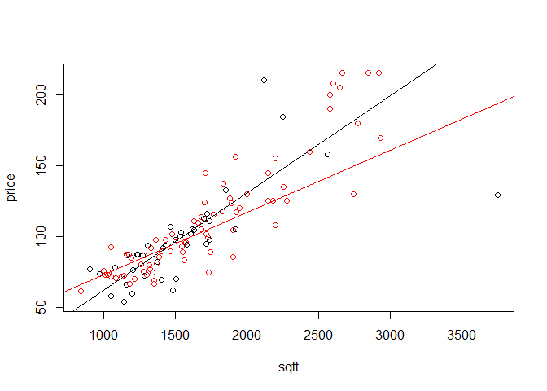
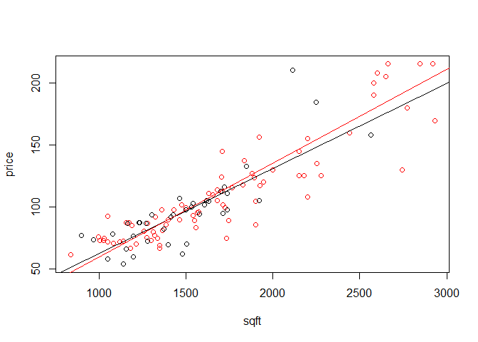
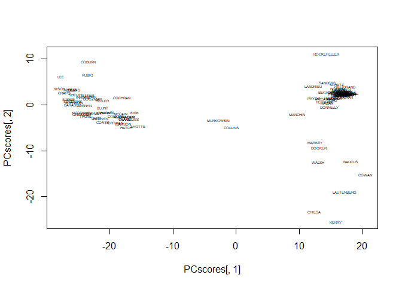
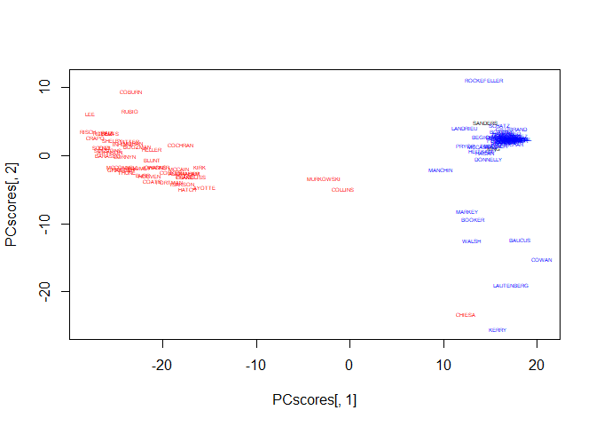
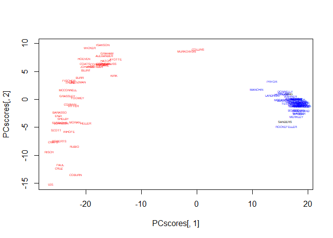

Problem Set 5
================
Ethan Witkowski
Spring 2019

<br> <br>

#### 2a)

``` r
homeprices <- read.csv("homeprices.csv")

# define variables
price <- homeprices[,"price"]
sqft <- homeprices[,"sqft"]
NE <- homeprices[,"NE"]

plot(price~sqft, col=NE+1)
#NE are light blue

# Linear model homes in NE and not in NE
fit1 <- abline(lm(price~sqft, subset=(NE==1)), col=1)
fit2 <- abline(lm(price~sqft, subset=(NE==0)), col=2)
```

<!-- -->

The regression lines would have different slopes if NE and sqft had an
interaction.

I do see evidence for an interaction, as the regression lines have
different slopes. <br> <br>

#### 2b)

``` r
fit3 <- lm(price ~ sqft + NE)
summary(fit3)
```

    ## 
    ## Call:
    ## lm(formula = price ~ sqft + NE)
    ## 
    ## Residuals:
    ##      Min       1Q   Median       3Q      Max 
    ## -101.905   -9.114    1.353    7.282   78.072 
    ## 
    ## Coefficients:
    ##             Estimate Std. Error t value Pr(>|t|)    
    ## (Intercept) 3.108520   6.549015   0.475    0.636    
    ## sqft        0.060879   0.003666  16.607   <2e-16 ***
    ## NE          3.720006   4.055259   0.917    0.361    
    ## ---
    ## Signif. codes:  0 '***' 0.001 '**' 0.01 '*' 0.05 '.' 0.1 ' ' 1
    ## 
    ## Residual standard error: 20.46 on 114 degrees of freedom
    ## Multiple R-squared:  0.7158, Adjusted R-squared:  0.7108 
    ## F-statistic: 143.5 on 2 and 114 DF,  p-value: < 2.2e-16

There is no evidence for a statistically significant interaction term,
as the p-value for NE is .361. <br> <br>

#### 2c)

Yes, there is an outlier home with 3750 square feet. <br> <br>

#### 2d)

``` r
homeprices <- homeprices[-79,]

# re-define variables
price <- homeprices[,"price"]
sqft <- homeprices[,"sqft"]
NE <- homeprices[,"NE"]

plot(price~sqft, col=NE+1)

# Linear model homes in NE and not in NE
fit1 <- abline(lm(price~sqft, subset=(NE==1)), col=1)
fit2 <- abline(lm(price~sqft, subset=(NE==0)), col=2)
```

<!-- -->

``` r
fit3 <- lm(price ~ sqft + NE)
summary(fit3)
```

    ## 
    ## Call:
    ## lm(formula = price ~ sqft + NE)
    ## 
    ## Residuals:
    ##     Min      1Q  Median      3Q     Max 
    ## -53.039  -9.151   0.327  10.096  69.868 
    ## 
    ## Coefficients:
    ##              Estimate Std. Error t value Pr(>|t|)    
    ## (Intercept) -7.320776   5.867117  -1.248    0.215    
    ## sqft         0.069685   0.003442  20.245   <2e-16 ***
    ## NE          -0.884970   3.563408  -0.248    0.804    
    ## ---
    ## Signif. codes:  0 '***' 0.001 '**' 0.01 '*' 0.05 '.' 0.1 ' ' 1
    ## 
    ## Residual standard error: 17.61 on 113 degrees of freedom
    ## Multiple R-squared:  0.7907, Adjusted R-squared:  0.787 
    ## F-statistic: 213.4 on 2 and 113 DF,  p-value: < 2.2e-16

The slopes of the NE and non-NE regression lines are much closer.

The 
estimate of the NE interaction term is closer to 0 (now negative), and
the p-value is much larger (.80). <br> <br>

#### 3a)

``` r
congress <- read.csv("senate.csv")

# define variables
name <- congress[,"name"]
state <- congress[,"state"]
party <- congress[,"party"]
votes <- congress[,4:660]
```

<br> <br>

#### 3b)

``` r
pca <- prcomp(votes, center=T, scale=T)
PCscores <- pca$x
# set up plot with no points
plot(PCscores[,1], PCscores[,2], type="n")
# plot the names
text(PCscores[,1], PCscores[,2], label=name, cex=.4)
```

<!-- --> <br>
<br>

#### 3c)

``` r
partycolor <- rep(NA, nrow(congress))
partycolor[party=="D"] <- "blue"
partycolor[party=="R"] <- "red"

pca <- prcomp(votes, center=T, scale=T)
PCscores <- pca$x
# set up plot with no points
plot(PCscores[,1], PCscores[,2], type="n")
# plot the names
text(PCscores[,1], PCscores[,2], label=name, cex=.4, col = partycolor)
```

<!-- -->

The first principal compenent appears to represent the issue of
immigration - as those on the left of the window oppose more
immigration, while those on the right of the window support more
immigration. <br> <br>

#### 3d)

These congresspeople are outliers because they only served partial
terms. <br> <br>

#### 3e)

``` r
congress <- congress[-c(42,43,44,53,54,63,64,65),]

name <- congress[,"name"]
state <- congress[,"state"]
party <- congress[,"party"]
votes <- congress[,4:660]

partycolor <- rep(NA, nrow(congress))
partycolor[party=="D"] <- "blue"
partycolor[party=="R"] <- "red"
```

The error occurs when attempting to perform the PCA because certain
votes have 0 variance (all congresspeople voted the same way) – this is
likely a result from a vote like “March 6th is National Tree Day,” where
all the congresspeople would vote the same way. <br> <br>

#### 3f)

``` r
#Find votes with 0 variance
#sort(apply(congress, 2, sd),
#      decreasing=T)

#Removing votes with 0 variance
congress <- congress[,-c(19,55,73,136,152,168,208,348,354,369,378,531,532,533,575)]

# define variables
name <- congress[,"name"]
state <- congress[,"state"]
party <- congress[,"party"]
votes <- congress[,4:645]

partycolor <- rep(NA, nrow(congress))
partycolor[party=="D"] <- "blue"
partycolor[party=="R"] <- "red"

#Run PCA without 0 variance columns/votes
pca <- prcomp(votes, center=T, scale=T)
PCscores <- pca$x
# set up plot with no points
plot(PCscores[,1], PCscores[,2], type="n")
# plot the names
text(PCscores[,1], PCscores[,2], label=name, cex=.4, col = partycolor)
```

<!-- --> <br>
<br>

#### 3g)

``` r
summary(pca)
```

    ## Importance of components:
    ##                            PC1     PC2     PC3     PC4     PC5     PC6     PC7
    ## Standard deviation     19.3090 4.85082 3.75175 3.54452 3.27306 3.07030 2.83982
    ## Proportion of Variance  0.5807 0.03665 0.02192 0.01957 0.01669 0.01468 0.01256
    ## Cumulative Proportion   0.5807 0.61740 0.63932 0.65889 0.67558 0.69026 0.70282
    ##                           PC8     PC9    PC10    PC11    PC12    PC13    PC14
    ## Standard deviation     2.7873 2.72667 2.59993 2.51917 2.48951 2.47893 2.36630
    ## Proportion of Variance 0.0121 0.01158 0.01053 0.00989 0.00965 0.00957 0.00872
    ## Cumulative Proportion  0.7149 0.72650 0.73703 0.74692 0.75657 0.76614 0.77486
    ##                           PC15    PC16    PC17    PC18    PC19    PC20    PC21
    ## Standard deviation     2.34425 2.27075 2.18388 2.13768 2.12731 2.06938 2.04662
    ## Proportion of Variance 0.00856 0.00803 0.00743 0.00712 0.00705 0.00667 0.00652
    ## Cumulative Proportion  0.78342 0.79146 0.79888 0.80600 0.81305 0.81972 0.82625
    ##                           PC22    PC23    PC24    PC25    PC26    PC27    PC28
    ## Standard deviation     2.02094 1.97710 1.96364 1.92130 1.85368 1.84701 1.79356
    ## Proportion of Variance 0.00636 0.00609 0.00601 0.00575 0.00535 0.00531 0.00501
    ## Cumulative Proportion  0.83261 0.83870 0.84470 0.85045 0.85580 0.86112 0.86613
    ##                           PC29    PC30   PC31    PC32    PC33    PC34   PC35
    ## Standard deviation     1.76072 1.74406 1.7362 1.70562 1.68979 1.65832 1.6025
    ## Proportion of Variance 0.00483 0.00474 0.0047 0.00453 0.00445 0.00428 0.0040
    ## Cumulative Proportion  0.87096 0.87570 0.8804 0.88492 0.88937 0.89365 0.8976
    ##                           PC36    PC37    PC38    PC39    PC40    PC41    PC42
    ## Standard deviation     1.57693 1.57490 1.54750 1.54280 1.52666 1.48846 1.44246
    ## Proportion of Variance 0.00387 0.00386 0.00373 0.00371 0.00363 0.00345 0.00324
    ## Cumulative Proportion  0.90153 0.90539 0.90912 0.91283 0.91646 0.91991 0.92315
    ##                           PC43    PC44    PC45    PC46    PC47    PC48    PC49
    ## Standard deviation     1.43197 1.41240 1.40638 1.37297 1.35808 1.33494 1.32301
    ## Proportion of Variance 0.00319 0.00311 0.00308 0.00294 0.00287 0.00278 0.00273
    ## Cumulative Proportion  0.92634 0.92945 0.93253 0.93547 0.93834 0.94112 0.94384
    ##                           PC50    PC51    PC52    PC53    PC54    PC55    PC56
    ## Standard deviation     1.28762 1.27373 1.25304 1.23111 1.22412 1.19898 1.17983
    ## Proportion of Variance 0.00258 0.00253 0.00245 0.00236 0.00233 0.00224 0.00217
    ## Cumulative Proportion  0.94643 0.94895 0.95140 0.95376 0.95609 0.95833 0.96050
    ##                           PC57    PC58    PC59    PC60    PC61   PC62    PC63
    ## Standard deviation     1.17186 1.12923 1.12008 1.08965 1.08360 1.0761 1.04978
    ## Proportion of Variance 0.00214 0.00199 0.00195 0.00185 0.00183 0.0018 0.00172
    ## Cumulative Proportion  0.96264 0.96463 0.96658 0.96843 0.97026 0.9721 0.97378
    ##                           PC64    PC65    PC66    PC67    PC68    PC69    PC70
    ## Standard deviation     1.03804 1.01841 0.98616 0.97879 0.95521 0.93119 0.92716
    ## Proportion of Variance 0.00168 0.00162 0.00151 0.00149 0.00142 0.00135 0.00134
    ## Cumulative Proportion  0.97546 0.97707 0.97859 0.98008 0.98150 0.98285 0.98419
    ##                           PC71    PC72    PC73    PC74    PC75    PC76    PC77
    ## Standard deviation     0.86058 0.84344 0.82900 0.79851 0.79280 0.76406 0.75222
    ## Proportion of Variance 0.00115 0.00111 0.00107 0.00099 0.00098 0.00091 0.00088
    ## Cumulative Proportion  0.98535 0.98645 0.98752 0.98852 0.98950 0.99041 0.99129
    ##                          PC78    PC79    PC80    PC81    PC82    PC83    PC84
    ## Standard deviation     0.7171 0.71142 0.69528 0.66705 0.64853 0.61729 0.59207
    ## Proportion of Variance 0.0008 0.00079 0.00075 0.00069 0.00066 0.00059 0.00055
    ## Cumulative Proportion  0.9921 0.99288 0.99363 0.99432 0.99498 0.99557 0.99612
    ##                           PC85    PC86    PC87    PC88    PC89    PC90    PC91
    ## Standard deviation     0.57318 0.54770 0.53620 0.51079 0.49581 0.48150 0.44311
    ## Proportion of Variance 0.00051 0.00047 0.00045 0.00041 0.00038 0.00036 0.00031
    ## Cumulative Proportion  0.99663 0.99710 0.99754 0.99795 0.99833 0.99869 0.99900
    ##                           PC92    PC93    PC94    PC95    PC96      PC97
    ## Standard deviation     0.40029 0.38510 0.36650 0.33527 0.29436 9.132e-15
    ## Proportion of Variance 0.00025 0.00023 0.00021 0.00018 0.00013 0.000e+00
    ## Cumulative Proportion  0.99925 0.99948 0.99969 0.99987 1.00000 1.000e+00

The first PCA accounts for 58.07% of the variance.

The second PCA accounts for 3.66% of variance by itself, 69.93% in
cumulative with PCA1.

36 PC’s are necessary to account for 90% of the variance in the dataset.
<br> <br>

#### 3h)

The first PC appears to represent if the congress person supports
pro-choice.

The second PC appears to represent voting on national debt, as there are
many tea party members on the bottom left of the graph.

Murkowski and Collins are outliers, as they are moderate republicans as
opposed to the more staunch republicans; for example, they are both
pro-choice. <br> <br>

#### 3i)

Yes, King and Sanders, and they more closely resemble democrats. <br>
<br>

#### 3j)

The democrats are more coherent in their voting.

It seems republicans are more spread on fiscal issues, as the tea party
republicans are on the bottom left.

There also seems to be a trend in republicans where those who are more
fiscally lenient are also more likely to vote pro-choice.
