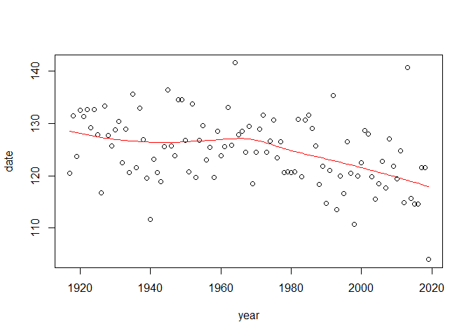
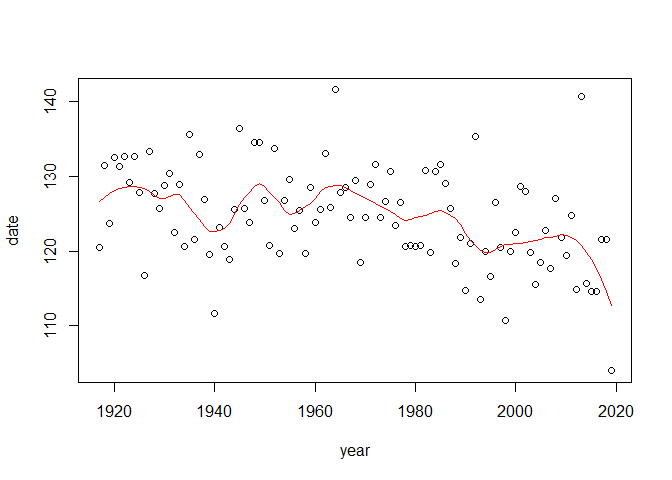
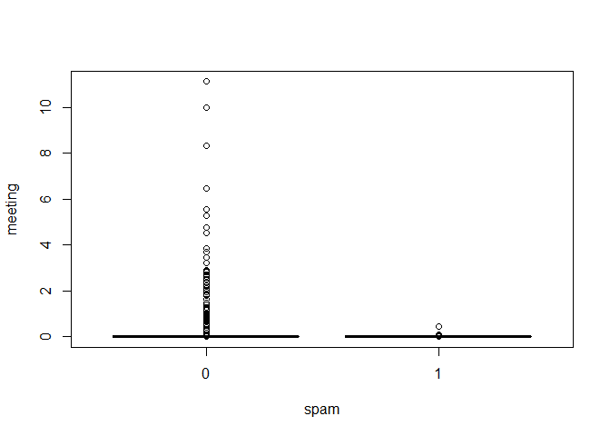
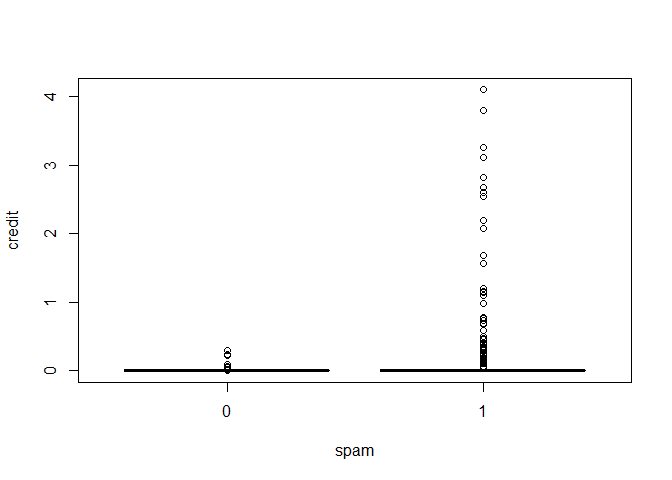

Problem Set 6
================
Ethan Witkowski
Spring 2019

<br> <br>

#### 1\)

``` r
#read in data frame
data <- read.csv("nenana.csv")

# define variables
year <- data[,"year"]
date <- data[,"date"]

#Loess model
fit1 <- loess(date ~ year, span=.75)
plot(year, date)
lines(year, predict(fit1), col="red")
```

<!-- -->

``` r
#Loess model 2 (smallest span)
fit2 <- loess(date ~ year, span=.25)
plot(year, date)
lines(year, predict(fit2), col="red")
```

<!-- -->

There is evidence for a warming trend, indicated by earlier yearly ice
break dates, especially from 1970 to 2019. When looking at the .75 span
model, there appears to be an inflection point at 1970, where prior
there is a relatively flat regression line, and after there is a more
downward sloping regression line. When changing the span to .25, we see
that there are changes in ice break date trends approximately every ten
years, however, the general downward trend after 1970 persists. <br>
<br>

#### 2a)

``` r
#read in data frame
data2 <- read.csv("spam.csv")

#Define Variables
spam <- data2[,"spam"]
meeting <- data2[,"meeting"]
credit <- data2[,"credit"]

boxplot(meeting ~ spam)
```

<!-- -->

There is ittle data available for spam messages, and all are near 0%.
Skewed data for real messages.

``` r
boxplot(credit ~ spam)
```

<!-- -->

There is little data available for real messages, and all are near 0%.
Skewed data for spam data. <br> <br>

#### 2b)

``` r
fit3 <- glm(spam ~ meeting + credit + meeting*credit, family=binomial)
```

    ## Warning: glm.fit: fitted probabilities numerically 0 or 1 occurred

``` r
summary(fit3)
```

    ## 
    ## Call:
    ## glm(formula = spam ~ meeting + credit + meeting * credit, family = binomial)
    ## 
    ## Deviance Residuals: 
    ##     Min       1Q   Median       3Q      Max  
    ## -2.7915  -1.0420  -0.4037   1.3191   2.3652  
    ## 
    ## Coefficients:
    ##                 Estimate Std. Error z value Pr(>|z|)    
    ## (Intercept)     -0.32714    0.06979  -4.687 2.77e-06 ***
    ## meeting         -5.34899    1.99205  -2.685  0.00725 ** 
    ## credit          14.49241    3.06264   4.732 2.22e-06 ***
    ## meeting:credit -28.39347   38.01171  -0.747  0.45508    
    ## ---
    ## Signif. codes:  0 '***' 0.001 '**' 0.01 '*' 0.05 '.' 0.1 ' ' 1
    ## 
    ## (Dispersion parameter for binomial family taken to be 1)
    ## 
    ##     Null deviance: 1368.8  on 999  degrees of freedom
    ## Residual deviance: 1186.6  on 996  degrees of freedom
    ## AIC: 1194.6
    ## 
    ## Number of Fisher Scoring iterations: 9

The interaction term is non-significant because the p-value is greater
than .05. A possible explanation is that the sample size of messages
with both the words “meeting” and “credit” is very small, or that the
effect size is small.

``` r
#Re-fit glm without interaction term
fit3 <- glm(spam ~ meeting + credit, family=binomial)
```

    ## Warning: glm.fit: fitted probabilities numerically 0 or 1 occurred

``` r
summary(fit3)
```

    ## 
    ## Call:
    ## glm(formula = spam ~ meeting + credit, family = binomial)
    ## 
    ## Deviance Residuals: 
    ##    Min      1Q  Median      3Q     Max  
    ## -2.706  -1.043  -0.409   1.318   2.546  
    ## 
    ## Coefficients:
    ##             Estimate Std. Error z value Pr(>|z|)    
    ## (Intercept) -0.32404    0.06971  -4.649 3.34e-06 ***
    ## meeting     -6.39484    2.25624  -2.834  0.00459 ** 
    ## credit      13.65183    2.74700   4.970 6.71e-07 ***
    ## ---
    ## Signif. codes:  0 '***' 0.001 '**' 0.01 '*' 0.05 '.' 0.1 ' ' 1
    ## 
    ## (Dispersion parameter for binomial family taken to be 1)
    ## 
    ##     Null deviance: 1368.8  on 999  degrees of freedom
    ## Residual deviance: 1187.7  on 997  degrees of freedom
    ## AIC: 1193.7
    ## 
    ## Number of Fisher Scoring iterations: 9

<br> <br>

#### 2c)

The coefficient of credit is 13.65, and it is a statistically
significant predictor.

Odds ratio = }}{e^{-.324+(13.65*1)}} = e^{13.65} = 847460.92")
<br> <br>

#### 2d)

The coefficient of meeting is -6.39. Meeting is a statistically
significant predictor.

Odds ratio = }}{e^{-.324+(-6.39*1)}} = e^{-6.39} = .00168")

This is interpreted as a 1 percentage point increase in the prevalence
of the word “meeting” predicts a multiplication of the odds of the
message being spam by .00168. <br> <br>

#### 2e)

``` r
#Create data
new <- as.data.frame(t(c(.2, 0)))
colnames(new) <- c("credit", "meeting")

predlogodds <- predict(fit3, newdata=new)
1 / (1 + exp(-predlogodds))
```

    ##         1 
    ## 0.9173082

<br> <br>

#### 2f)

``` r
predlogodds <- predict(fit3)
predprobs <- 1 / (1 + exp(-predlogodds))
predspam <- predprobs >= .5

#Create table predicted spam, spam
table(predspam, spam)
```

    ##         spam
    ## predspam   0   1
    ##    FALSE 559 354
    ##    TRUE    7  80

Precentage of predicted spam that are actually spam:


Percentage of predicted non-spam that are actually non-spam:

 <br> <br>

#### 2g)

The spam filter is conservative because only 61% of the predicted
non-spam were non-spam messages, while 92% of the predicted spam
messages were actually spam messages.

We can change the aggressiveness of the spam filter by adjusting what
the necessary predicted probability (predspam) is for the filter to
consider it a spam message.
